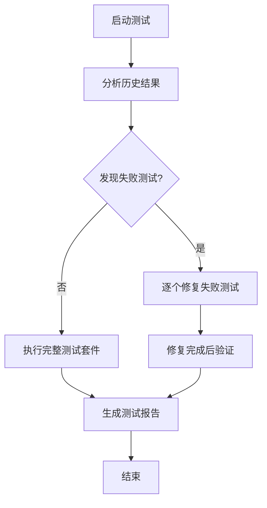

# E2E Robot - Claude Code Agents 测试自动化系统

一个基于 TypeScript 和 Claude Code SDK 的智能端到端测试机器人框架，支持交互式配置、智能测试生成和自动调试修复。

## 🚀 核心特性

- 🤖 **Claude AI 驱动**: 基于 Claude Code SDK 的智能测试生成
- 💬 **交互式配置**: 对话式界面配置测试站点和需求
- 🔧 **智能调试**: 自动分析失败测试并进行最多 10 轮修复
- 📊 **历史分析**: 智能分析测试结果，针对性修复失败用例
- 🎯 **多维测试**: 支持功能、UX、响应式、性能、兼容性、安全等测试类型
- 📝 **完整报告**: 生成详细的测试报告和修复统计
- 🔄 **5步工作流**: 网站分析 → 场景生成 → 用例创建 → 测试执行 → 结果校准

## 📋 快速开始

### 环境准备

```bash
# 安装依赖
pnpm install

# 设置 Claude API Key
export ANTHROPIC_API_KEY="your-anthropic-api-key"

# 可选：安装 Claude Code CLI
npm install -g @anthropic-ai/claude-code
```

### 运行测试自动化系统

```bash
# 启动交互式配置模式（推荐）
pnpm claude-agents

# 使用默认配置运行
pnpm claude-agents --no-interactive

# 开发模式（带热重载）
pnpm dev
```

## 💬 交互式配置

系统启动后会引导您完成以下配置：

### 1. 🌐 配置测试站点
```
请输入目标网站URL: https://www.example.com
请输入站点名称: Example Website
```

### 2. 📋 配置测试要求
```
请描述您的测试需求，每行一个要求：
要求 1: 测试首页加载功能
要求 2: 验证搜索功能正常工作
要求 3: 检查用户登录流程
要求 4: [空行结束]
```

### 3. 🧪 选择测试类型
```
请选择需要的测试类型 (多选，用空格分隔):
1. 功能测试 (基础功能验证)
2. 用户体验测试 (UI/UX测试)
3. 响应式测试 (移动端适配)
4. 性能测试 (加载速度测试)
5. 兼容性测试 (跨浏览器测试)
6. 安全测试 (基础安全检查)

选择: 1 2
```

### 4. ⚙️ 配置测试参数
```
最大测试用例数 (默认: 20): 25
测试优先级 (low/medium/high, 默认: medium): high
超时时间 (秒, 默认: 600): 900
```

### 5. ✅ 确认配置
系统会显示完整配置总结，确认后开始自动化测试流程。

## 🛠️ 开发命令

### 基础命令
```bash
pnpm dev                    # 开发模式启动
pnpm build                  # 构建项目
pnpm start                  # 运行构建后的应用
pnpm clean                  # 清理构建文件
```

### 测试示例
```bash
pnpm simple-test            # 基础 Playwright 测试
pnpm playwright-example     # 完整 Playwright 示例
pnpm claude-integration     # Claude SDK + Playwright 集成
pnpm demo-fixed            # 修复后的集成演示
pnpm test-code-cleaning     # 测试代码清理功能
pnpm test-safe-executor     # 测试安全代码执行
```

## 🏗️ 项目架构

### 核心组件

```
src/
├── agents/                      # Claude agents 系统
│   ├── types.ts                # 共享类型定义
│   ├── orchestrator.ts         # 主协调器
│   ├── website-analyzer.ts     # 网站分析代理
│   ├── scenario-generator.ts   # 测试场景生成代理
│   ├── testcase-generator.ts   # 测试用例生成代理
│   ├── test-runner.ts          # 测试执行代理（含智能调试）
│   ├── test-result-analyzer.ts # 测试结果分析器
│   ├── calibrator.ts           # 结果校准器
│   └── claude-executor.ts      # Claude API 执行器
├── cli/                        # 交互式命令行界面
│   └── interactive-config.ts   # 对话式配置系统
└── claude-agents-main.ts       # 系统入口
```

### Agent 架构

**TestAutomationOrchestrator** - 主协调器
- 协调所有代理完成 5 步测试流程
- 管理执行顺序和状态传递
- 支持从任意步骤开始执行

**智能代理系统**
- `WebsiteAnalyzer` - 分析目标网站结构和功能
- `ScenarioGenerator` - 基于分析结果和用户需求生成测试场景
- `TestCaseGenerator` - 将场景转换为可执行的 Playwright 测试代码
- `TestRunner` - 执行测试并支持自动调试修复
- `TestResultAnalyzer` - 分析测试结果，识别失败用例
- `Calibrator` - 基于成功测试进行系统校准

## 🔧 核心功能

### 1. 智能测试执行
- **历史分析**: 自动分析 `test-results/` 目录中的历史失败
- **针对性修复**: 识别失败测试用例并逐个修复
- **多轮调试**: 每个失败测试最多 3 轮修复，整体最多 10 轮
- **选择性测试**: 使用 `--grep` 单独验证修复结果

### 2. 自动化调试系统
- **错误分析**: 智能分析测试失败原因
- **代码修复**: 自动修正选择器、等待时间、断言等问题
- **bash 集成**: 使用 `npx playwright test` 执行测试
- **修复验证**: 修复后立即验证单个测试用例

### 3. 测试结果分析
- **多格式支持**: 解析 JSON、XML 格式测试结果（Playwright、Jest、JUnit）
- **失败检测**: 提取详细错误信息和位置
- **统计报告**: 生成修复成功率和详细分析报告
- **历史对比**: 对比当前结果与历史运行记录

### 4. 配置管理
- **持久化**: 配置自动保存到 `test-config.json`
- **配置重用**: 基于已有配置进行修改
- **智能默认**: 合理的默认值和验证
- **灵活模式**: 交互式或非交互式执行

## 📊 执行流程

### 5步自动化工作流

1. **🔍 网站分析** (Website Analysis)
   - 分析目标网站结构、功能和可测试元素
   - 识别关键交互组件和用户流程

2. **📝 场景生成** (Scenario Generation)
   - 基于网站分析和用户需求生成测试场景
   - 考虑不同测试类型和优先级

3. **⚙️ 用例生成** (Test Case Generation)
   - 将测试场景转换为可执行的 Playwright 代码
   - 生成结构化、可维护的测试用例

4. **🚀 测试执行** (Test Execution)
   - 智能执行测试，支持历史失败分析
   - 自动调试和修复失败的测试用例

5. **📈 结果校准** (Calibration)
   - 基于成功测试进行系统校准和优化
   - 生成改进建议和最佳实践

### 智能执行策略



## 📄 输出文件

### 自动生成的文件

```
claude-agents-output/
├── test-config.json          # 用户配置
├── website-analysis.md       # 网站分析报告
├── test-scenarios.md         # 测试场景文档
├── test-cases.spec.ts        # 生成的测试用例
├── test-report.md           # 测试执行报告
├── test-results.json        # 详细测试结果
├── message.log              # Claude 交互日志
└── calibration-report.md    # 校准报告
```

### 测试结果目录

```
test-results/                # Playwright 测试结果
├── *.json                   # JSON 格式结果
├── *.xml                    # XML 格式结果（JUnit）
└── playwright-report/       # HTML 报告
```

## 🔧 高级配置

### 配置文件示例 (`test-config.json`)

```json
{
  "targetUrl": "https://www.example.com",
  "siteName": "Example Website",
  "testRequirements": [
    "测试首页加载功能",
    "验证搜索功能正常工作",
    "检查用户登录流程",
    "测试产品页面展示"
  ],
  "testTypes": ["functional", "ux", "responsive"],
  "maxTestCases": 25,
  "priority": "high",
  "timeout": 900000,
  "workDir": "/path/to/claude-agents-output",
  "verbose": true
}
```

### 测试类型说明

| 类型 | 英文标识 | 说明 |
|------|----------|------|
| 功能测试 | `functional` | 验证网站基础功能是否正常 |
| 用户体验测试 | `ux` | 测试用户界面和交互体验 |
| 响应式测试 | `responsive` | 检查移动端和不同设备适配 |
| 性能测试 | `performance` | 测试页面加载速度和性能 |
| 兼容性测试 | `compatibility` | 验证跨浏览器兼容性 |
| 安全测试 | `security` | 基础安全检查和验证 |

## 🛠️ 技术栈

### 核心技术
- **TypeScript** 5.3.0 - 类型安全的 JavaScript
- **Claude Code SDK** 1.0.58 - AI 代码生成和执行
- **Playwright** 1.54.1 - 浏览器自动化测试
- **Node.js** - 运行时环境

### 开发工具
- **tsx** 4.6.0 - TypeScript 执行器
- **pnpm** - 快速包管理器
- **dotenv** - 环境变量管理

### AI 集成
- **@anthropic-ai/claude-code** - Claude Code SDK
- **@anthropic-ai/sdk** - Claude API SDK
- **MCP Servers** - 模型控制协议集成

## 📈 最佳实践

### 1. 配置建议
- 首次使用建议从简单网站开始测试
- 测试要求应具体明确，避免过于宽泛
- 根据网站复杂度调整最大测试用例数

### 2. 调试技巧
- 查看 `message.log` 了解 Claude 执行过程
- 检查 `test-results/` 目录了解失败原因
- 使用 `--no-interactive` 模式进行批量测试

### 3. 性能优化
- 合理设置超时时间，复杂网站建议 15 分钟以上
- 优先级设置为 `high` 可获得更详细的测试用例
- 定期清理 `claude-agents-output/` 目录

## 🤝 贡献指南

欢迎提交 Issue 和 Pull Request！

### 开发流程
1. Fork 项目
2. 创建功能分支 (`git checkout -b feature/AmazingFeature`)
3. 提交更改 (`git commit -m 'Add some AmazingFeature'`)
4. 推送到分支 (`git push origin feature/AmazingFeature`)
5. 创建 Pull Request

### 代码规范
- 使用 TypeScript 严格模式
- 遵循 ESLint 和 Prettier 配置
- 添加适当的类型注解和注释
- 编写单元测试

## 📜 许可证

本项目采用 ISC 许可证 - 查看 [LICENSE](LICENSE) 文件了解详情。

## 🙋‍♂️ 支持

如果您在使用过程中遇到问题：

1. 查看 [CLAUDE.md](CLAUDE.md) 获取详细技术文档
2. 检查 `claude-agents-output/message.log` 查看执行日志
3. 提交 Issue 描述具体问题
4. 参考示例配置和最佳实践

---

🤖 **Claude Code Agents** - 让 AI 为您的测试赋能！